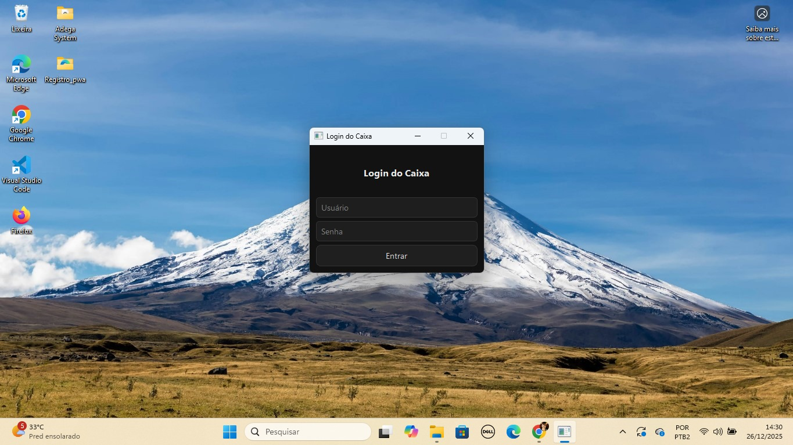
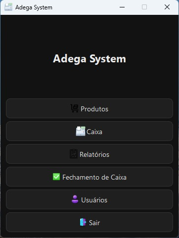
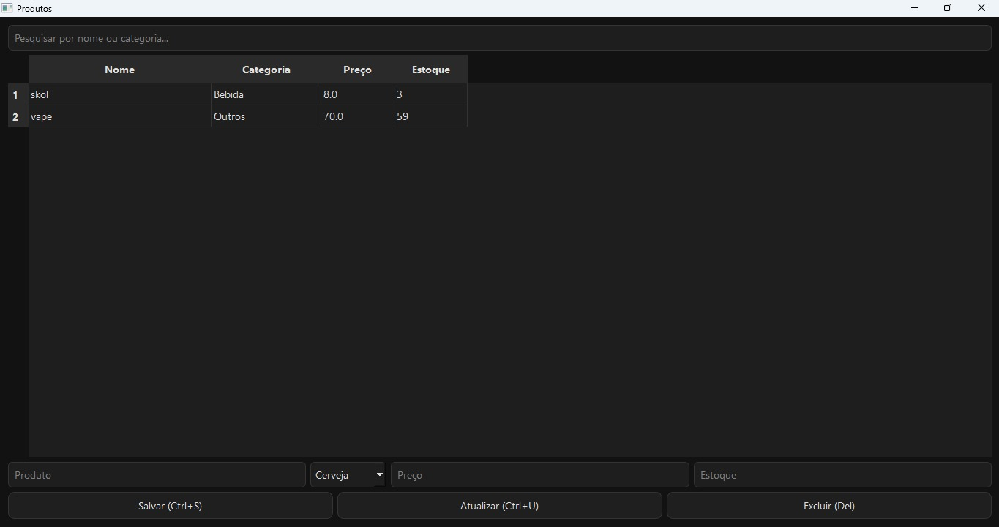
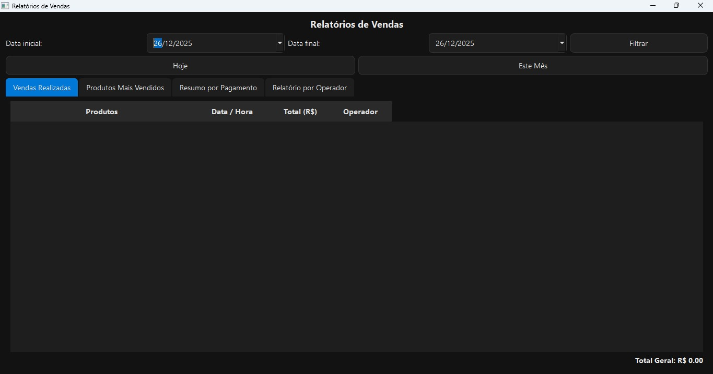

# 🍷 Adega System

Sistema desktop para controle de **estoque**, **caixa (PDV)** e **relatórios**, desenvolvido em Python.  
Projetado para pequenas e médias adegas, com foco em **rapidez no atendimento**, **facilidade de uso** e **controle operacional**.

---

## 📌 Funcionalidades

### 📦 Produtos
- Cadastro de produtos com **categoria**
- Atualização e exclusão de produtos
- Pesquisa rápida por **nome ou categoria**
- Controle de estoque em tempo real

## 🖼️ Telas do Sistema

### Login


### Menu Principal


### Produtos


### Caixa (PDV)


### Relatórios



### 🧾 Caixa (PDV)
- Busca rápida de produtos
- Carrinho de compras
- Controle automático de estoque
- Formas de pagamento:
  - Dinheiro
  - Pix
  - Cartão
- Atalhos de teclado para agilizar o atendimento

### 📊 Relatórios
- Relatório de vendas
- Produtos mais vendidos
- Faturamento por período
- Filtro por **data**, **hoje** e **este mês**
- Relatório por operador (admin)

### 👤 Usuários
- Login com usuário e senha
- Senha criptografada
- Perfis:
  - **Admin**
  - **Operador**
- Controle de permissões por perfil

### 💾 Banco de Dados
- Banco local SQLite
- Backup automático configurável
- Estrutura preparada para expansão

---

## ⌨️ Atalhos de Teclado

| Ação | Atalho |
|----|----|
| Adicionar produto ao carrinho | Enter |
| Finalizar venda | F2 |
| Fechar caixa | Esc |
| Salvar produto | Ctrl + S |
| Atualizar produto | Ctrl + U |
| Excluir produto | Delete |

---

## 🖥️ Tecnologias Utilizadas

- **Python 3**
- **PySide6 (Qt for Python)** — Interface gráfica
- **SQLite** — Banco de dados local
- **PyInstaller** — Geração de executável (.exe)
- **Git / GitHub** — Controle de versão

---

## 📂 Estrutura do Projeto

Sistema Adega
├── main.py
├── database.py
├── sessao.py
├── produtos.py
├── telas/
│ ├── caixa.py
│ ├── relatorios.py
│ ├── usuarios.py
│ └── fechamento.py
├── ícones/
├── estilo/
└── README.md


---

## 🚀 Como Executar (Modo Desenvolvimento)

```bash
python main.py


📦 Executável

O sistema pode ser empacotado como seguevel Windows ( .exe) usando PyInstaller.

🎯 Objetivo do Projeto

Este projeto foi desenvolvido com foco em:

aprendizado prático

resolução de problemas reais

criação de um sistema comercial funcional

composição de portfólio profissional

👨‍💻 Autor

Jean Alves
Desenvolvedor Python
Projeto desenvolvido para fins de aprendizado e portfólio.

📄 Licença

Este projeto é de uso educacional e demonstrativo.


---

## ✅ COMO ATUALIZAR NO GITHUB

No VS Code:

```powershell
git add README.md
git commit -m "Melhora README com descrição profissional do projeto"
git push


